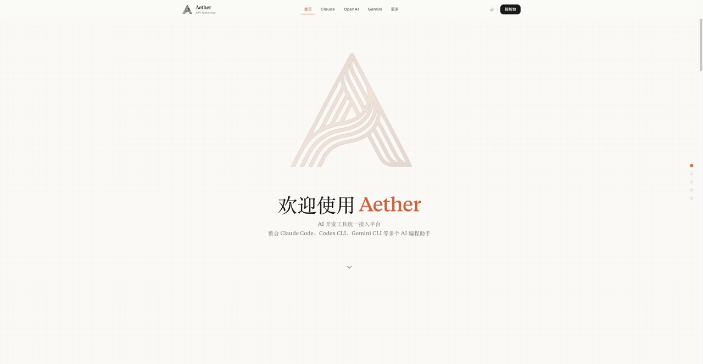
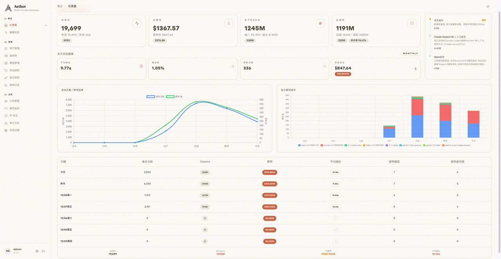
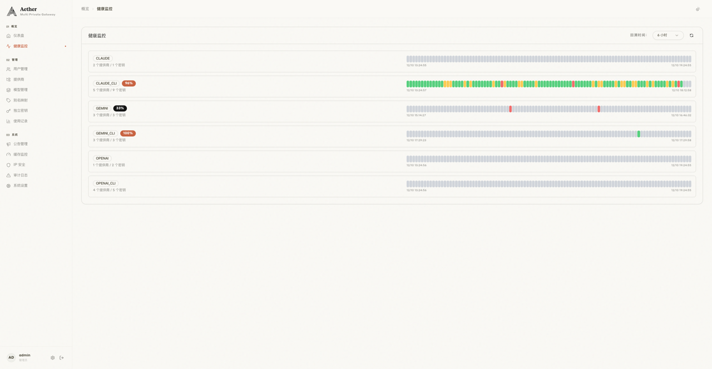
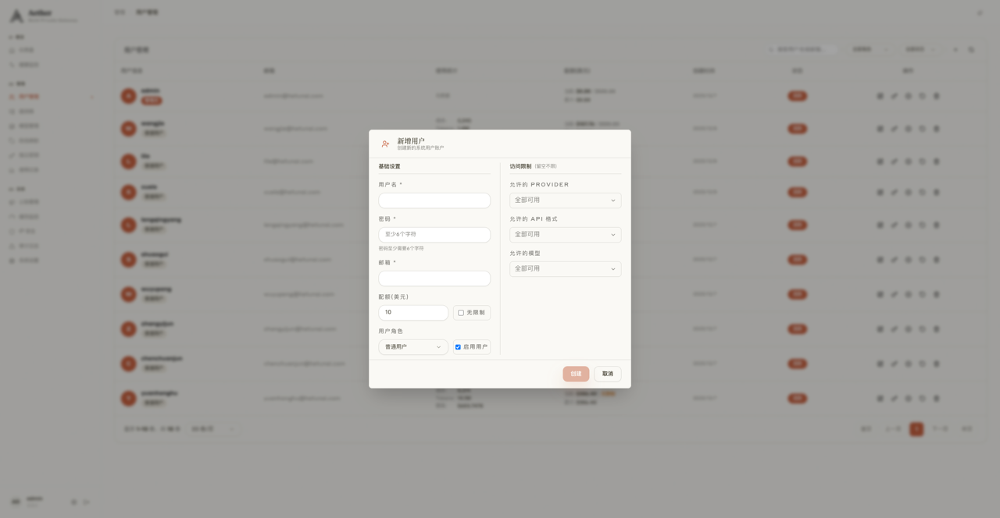
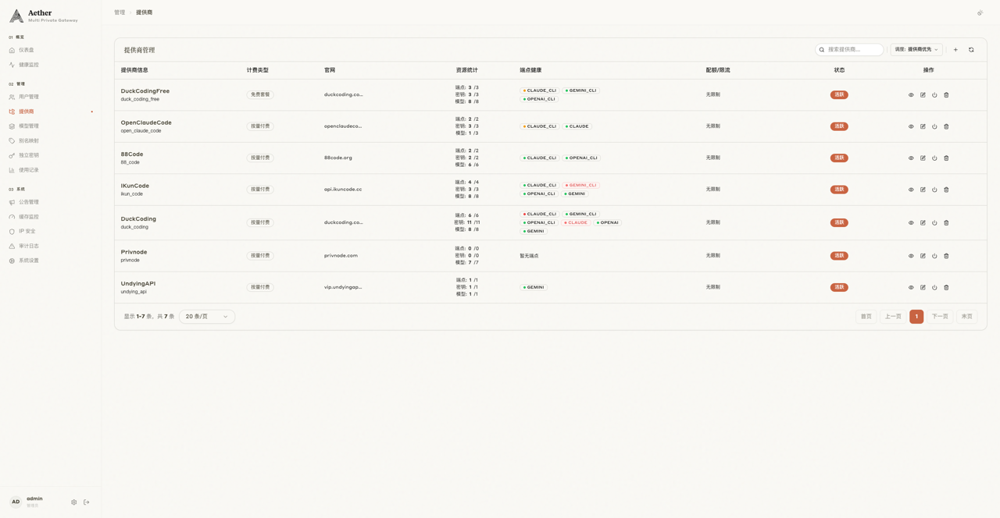
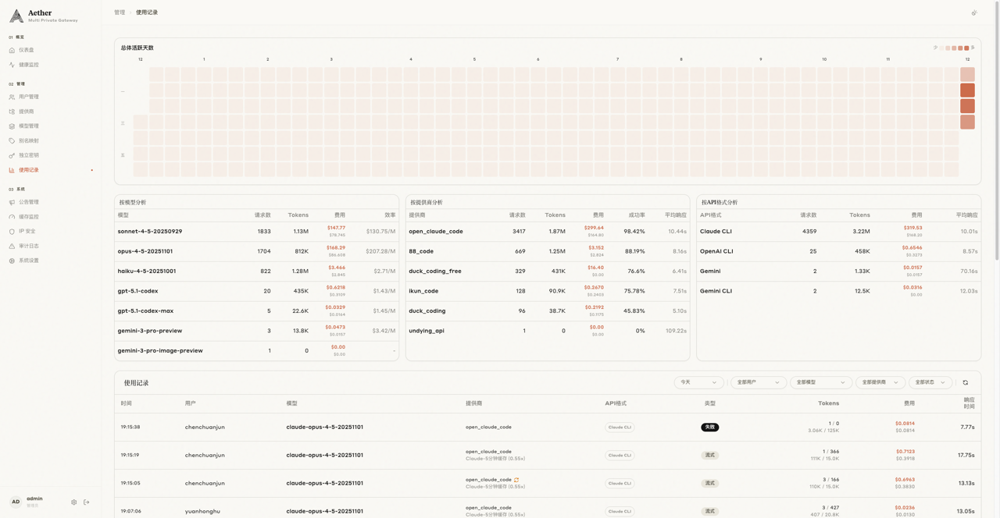
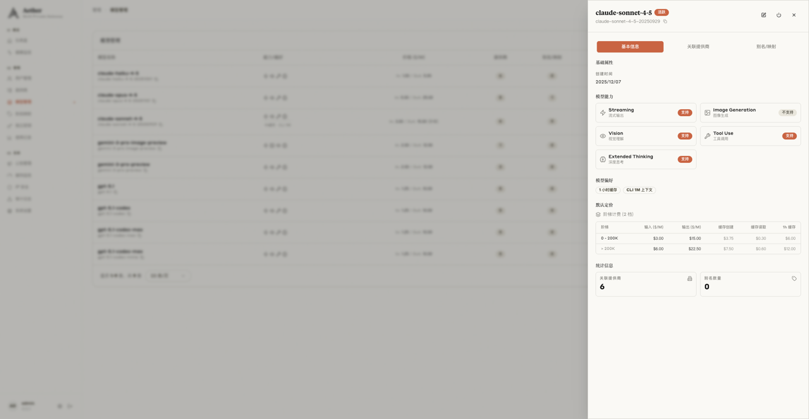
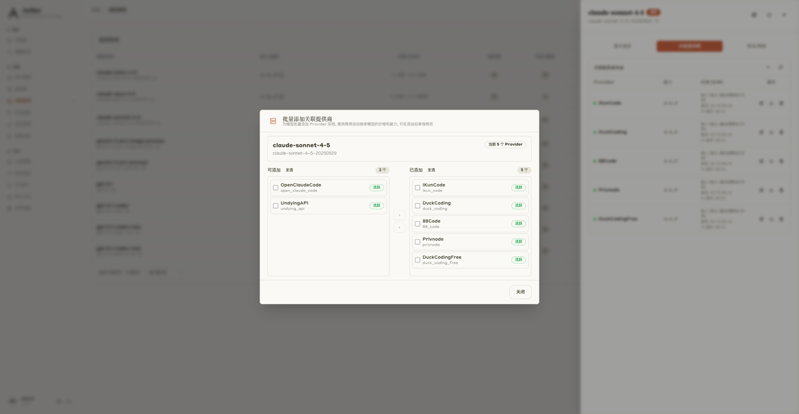
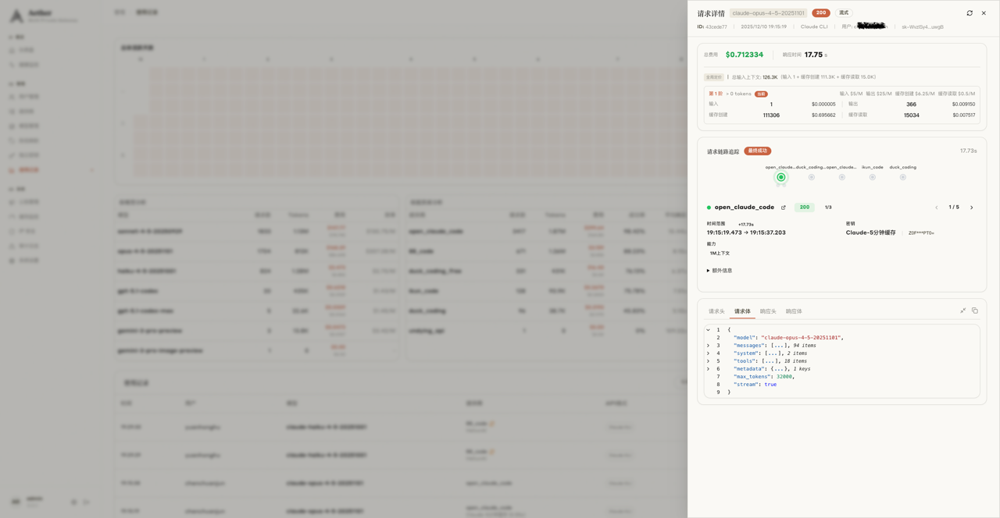
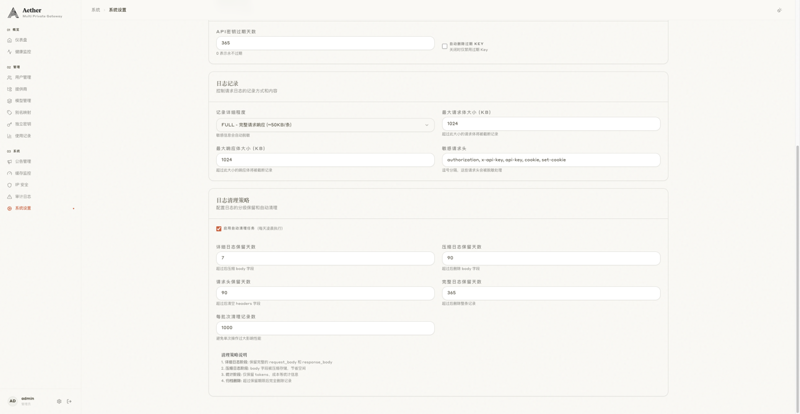

<p align="center">
  
</p>

<h1 align="center">Aether</h1>

<p align="center">
  <strong>开源 AI API 网关</strong><br>
  支持 Claude / OpenAI / Gemini 及其 CLI 客户端的统一接入层
</p>

<p align="center">
  <a href="#特性">特性</a> •
  <a href="#架构">架构</a> •
  <a href="#部署">部署</a> •
  <a href="#环境变量">环境变量</a> •
  <a href="#qa">Q&A</a>
</p>

---

## 简介

Aether 是一个自托管的 AI API 网关，为团队和个人提供多租户管理、智能负载均衡、成本配额控制和健康监控能力。通过统一的 API 入口，可以无缝对接 Claude、OpenAI、Gemini 等主流 AI 服务及其 CLI 工具。

### 页面预览

| 首页 | 仪表盘 |
|:---:|:---:|
|  |  |

| 健康监控 | 用户管理 |
|:---:|:---:|
|  |  |

| 提供商管理 | 使用记录 |
|:---:|:---:|
|  |  |

| 模型详情 | 关联提供商 |
|:---:|:---:|
|  |  |

| 链路追踪 | 系统设置 |
|:---:|:---:|
|  |  |

## 部署

### Docker Compose（推荐）

```bash
# 1. 克隆代码
git clone https://github.com/fawney19/Aether.git
cd aether

# 2. 配置环境变量
cp .env.example .env
python generate_keys.py  # 生成密钥, 并将生成的密钥填入 .env

# 3. 部署
./deploy.sh  # 自动构建、启动、迁移
```

### 本地开发

```bash
# 启动依赖
docker-compose up -d postgres redis

# 后端
uv sync
./dev.sh

# 前端
cd frontend && npm install && npm run dev
```

## 环境变量

### 必需配置

| 变量 | 说明 |
|------|------|
| `DB_PASSWORD` | PostgreSQL 数据库密码 |
| `REDIS_PASSWORD` | Redis 密码 |
| `JWT_SECRET_KEY` | JWT 签名密钥（使用 `generate_keys.py` 生成） |
| `ENCRYPTION_KEY` | API Key 加密密钥（更换后需重新配置 Provider Key） |
| `ADMIN_EMAIL` | 初始管理员邮箱 |
| `ADMIN_USERNAME` | 初始管理员用户名 |
| `ADMIN_PASSWORD` | 初始管理员密码 |

### 可选配置

| 变量 | 默认值 | 说明 |
|------|--------|------|
| `APP_PORT` | 8084 | 应用端口 |
| `API_KEY_PREFIX` | sk | API Key 前缀 |
| `LOG_LEVEL` | INFO | 日志级别 (DEBUG/INFO/WARNING/ERROR) |
| `GUNICORN_WORKERS` | 4 | Gunicorn 工作进程数 |
| `DB_PORT` | 5432 | PostgreSQL 端口 |
| `REDIS_PORT` | 6379 | Redis 端口 |

## Q&A

### Q: 如何开启/关闭请求体记录？

1. 管理员在系统设置中, 设置日志记录的记录详细程度.

- Base: 基本请求信息。
- Headers: Base + 请求头。
- Full: Base + 请求头 + 请求体。

### Q: 管理员如何给模型配置1M上下文 / 1H缓存 能力支持?

1. 在模型管理中, 给模型设置1M上下文 / 1H缓存的能力支持, 并配置好价格.
2. 在提供商管理中, 给端点添加支持1M上下文 / 1H缓存的能力的密钥并勾选1M上下文 / 1H缓存能里标签.

### Q: 用户如何使用1H缓存?

1. 用户在管理管理中针对指定模型使用1H缓存策略, 或者在密钥管理中针对指定密钥使用1H缓存策略.
注意: 用户若对密钥设置强制1H缓存, 则该密钥只能使用支持1H缓存的模型.

### Q: 如何配置负载均衡？

在管理后台「提供商管理中」中切换调度模式，系统提供两种调度策略：

1. **提供商优先 (provider)**：按 Provider 优先级排序，同优先级内按 Key 的内部优先级排序，相同优先级通过哈希分散实现负载均衡。适合希望优先使用特定供应商的场景。

2. **全局 Key 优先 (global_key)**：忽略 Provider 层级，所有 Key 按全局优先级统一排序，相同优先级通过哈希分散实现负载均衡。适合跨 Provider 统一调度、最大化利用所有 Key 的场景。

### Q: 提供商免费套餐的计费模式会计入成本吗?

免费套餐的计费模式, 可以视作倍率为0, 因此产生的记录不会计入倍率费用。

---

## 许可证

本项目采用 [Aether 非商业开源许可证](LICENSE)。
